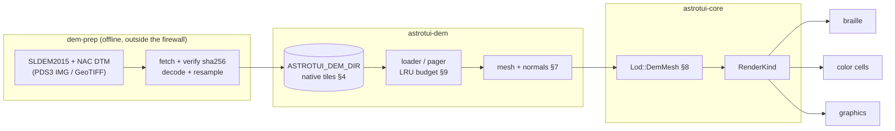

# astrotui-dem — DEM source, format & pipeline design

Resolves OI-1 (#41). Gates the four staged DEM tasks: #26 (static site → mesh →
shade), #27 (dynamic tiling/paging), #28 (LOD + memory budget), #29 (hillshade
across all backends). Each stage PR cites its governing section here (§12).

This document is subordinate to [`DESIGN.md`](DESIGN.md): §6 fixes the
high-level flow (producer-supplied ME frame, DEM → Cartesian vertices in
`PlanetFixed<Moon>`, Sun-from-stream lighting, `Topocentric<Moon>` camera);
this doc locks everything below that line. One deliberate amendment to §6 is
made in §3 (the reference surface) and applied to `DESIGN.md` in the same PR.

Normative vs illustrative: the numbers that gate stage acceptance — the tile
header layout, the pyramid levels, the memory budget — are **normative**.
Rust identifiers and struct sketches are **illustrative**; stage PRs may name
things better.

---

## 1. Scope & the firewall, restated

`astrotui-dem` turns height tiles into shaded meshes in a body-fixed frame.
Per the DESIGN.md §12 firewall and §9 crate layout, it must hold:

- **No ephemeris, no ANISE, no Bevy.** Lighting direction and the Moon-fixed
  frame arrive from the stream like everything else.
- **No network I/O.** Acquisition is an offline producer-side concern (§5).
- **No heavyweight format parsers.** PDS3/GeoTIFF reading lives in the offline
  prep tool (§5), never in the render path. `astrotui-dem` reads only the
  astrotui-native tile format (§4), whose decoder is a few dozen lines over
  `std::io`.

Dependencies stay as today: `astrodyn_planet` (constants only) — plus
`astrotui-core` when Stage 1 wires meshes into the scene. Anything more needs
a design amendment here.

## 2. Source selection

Criteria: descent-track coverage at the target site, resolution at terminal
descent, format tractability for an offline converter, total download size,
and an unambiguous datum.

| Product | Resolution | Coverage | Format | Verdict |
|---|---|---|---|---|
| SLDEM2015 (LOLA + Kaguya TC merge) | 512 ppd ≈ 59.2 m/px, vertical accuracy ~3–4 m | ±60° lat, global in lon | PDS3 float `.IMG` + `.LBL` (512 ppd: 32 tiles of 30°×45°, 1.42 GB each; 128/256 ppd global single files) | **Base layer** (levels 4–7, §4.2) |
| LROC NAC DTM (site mosaics) | 2–5 m/post | site footprints | PDS3 `.IMG` **and** 32-bit float GeoTIFF | **Site tier** (levels 8–11, §4.2) |
| LOLA LDEM GDR | cylindrical 4–512 ppd; polar stereographic down to 5 m/px true-at-pole (87.5°+) | global / polar | PDS3 `.IMG` | Not used in v1; **the documented polar path** if a future scenario leaves ±60° (would add a polar-stereographic tile scheme, out of scope per §4.2) |

(A USGS Astrogeology GeoTIFF mosaic of SLDEM2015 also exists — one 22.65 GB
16-bit file, elevations DN×0.5 m. Not used: the imbrium FLOAT products keep
full f32 precision, ship in site-sized pieces, and their labels state the
frame authoritatively; the USGS labels say only `PLANETOCENTRIC`.)

**Decision: the target site is Apollo 17 / Taurus-Littrow**, and the site tier
is **`NAC_DTM_APOLLO17`** (fetched 2026-06-09 from the product page and PDS
directory, §13):

- It is by far the largest Apollo-site NAC DTM: a single seamless 22-stereo-pair
  mosaic, **5 m posts**, footprint 19.3907–21.3033°N / 29.9057–31.6576°E
  (≈ 58 × 50 km), 442 MB as GeoTIFF. The LM approached eastward down the
  valley axis; ~50 km of E–W coverage holds essentially the whole visually
  interesting final approach.
- Relief is ideal for hillshade: a flat valley floor walled by steep highland
  massifs. The archive even ships a reference hillshade
  (`NAC_DTM_APOLLO17_SHADE.TIF`, sun az 315°/alt 45°) to sanity-check renders.
- 20.35°N center: comfortably inside SLDEM2015 coverage, plain
  equirectangular, no polar complications.
- Runner-up: Apollo 15 (`NAC_DTM_APOLLO15_2`, 5 m, 53 × 15 km) — Hadley Rille
  is dramatic, but the narrow E–W extent clips the Apennine front. The 2 m
  single-pair DTMs (Apollo 11/12/14/15/16) are ~4–5 km-wide strips; almost
  none of an approach track fits.
- Known NAC DTM artifacts (per the product README): ~0.5–1 m "boxes",
  stereo-model seams, interpolation in shadow. Irrelevant at our rendering
  scales; the `_CONF` confidence map exists if Stage 1 wants masking.

## 3. Reference surface (datum) — amendment to DESIGN.md §6

Lunar DEMs do not measure height above the `astrodyn_planet::MOON` oblate
ellipsoid (r_eq 1738.14 km, r_pol 1736.07 km). LOLA-derived products store
**planetocentric elevations relative to a 1737.4 km sphere**, in the
mean-Earth/polar-axis (ME) frame tied to DE421. Verbatim from the SLDEM2015
PDS label (fetched 2026-06-09, §13): *"Map values are relative to a radius of
1737.4 km"*, `COORDINATE_SYSTEM_NAME = "MEAN EARTH/POLAR AXIS OF DE421"`,
`COORDINATE_SYSTEM_TYPE = "BODY-FIXED ROTATING"`. The NAC DTM label agrees
(`A_AXIS_RADIUS = B_AXIS_RADIUS = C_AXIS_RADIUS = 1737.4 <KM>`,
`COORDINATE_SYSTEM_NAME = PLANETOCENTRIC`, `POSITIVE_LONGITUDE_DIRECTION =
EAST`) and is vertically controlled to LOLA tracks (RMS 1.77 m against 30
orbit tracks), inheriting the ME frame through that control.

**Decision: vertices are placed from radius, not ellipsoid-plus-height.**

```text
R_SPHERE          = 1_737_400.0 m                  (the LOLA reference radius)
r(lat, lon)       = R_SPHERE + h_tile(lat, lon)    (h_tile in metres, §4.1)
vertex (ME frame) = r · [cos(lat)·cos(lon), cos(lat)·sin(lon), sin(lat)]
```

planetocentric latitude/longitude, metres, in `PlanetFixed<Moon>` — exactly
the frame the producer ships per DESIGN.md §6 step 1. No ellipsoid enters
vertex placement; converting the datum to the ellipsoid would *introduce*
error into data whose native reference is the sphere.

This amends §6 step 2 as written ("lat/lon/height over the lunar mean radius →
Cartesian … using `astrodyn_planet::MOON` … + height") and the equivalent
wording in #26. The ellipsoid remains what the **pre-DEM LOD stages** draw
(point → oblate-ellipsoid silhouette), which leaves a radial seam at the
`Ellipsoid → DemMesh` transition:

- Worst-case discrepancy between the 1737.4 km sphere and the ellipsoid is
  1.33 km (sphere above r_pol at the poles; 0.74 km under r_eq at the
  equator; ~0.5 km at the site latitude) — under 8×10⁻⁴ of the lunar radius.
- At the §8 transition the body's projected radius is on the order of 10²
  cells, so that discrepancy is ~0.1 cell — far below cell resolution — and
  the hysteresis band ensures it never flickers.

Terrain self-consistency is what matters during descent, and within the DEM
everything shares one datum.

## 4. Tile format & scheme

### 4.1 Native tile format

Source products (PDS3 `.IMG`, GeoTIFF) are converted **offline** (§5) into an
astrotui-native tile: a small fixed header + a row-major `f32` height grid.
Rationale: the render path needs zero format dependencies (§1), tiles become
mmap-friendly and checksummable, and the codec is trivially round-trip
testable.

```text
offset  size  field
0       8     magic "ATUIDEM1" (version baked into magic)
8       2     level        (u16, pyramid level, §4.2)
10      4     row          (u32, tile row at this level)
14      4     col          (u32, tile col at this level)
18      2     samples      (u16, samples per tile edge: SAMPLES = 256)
20      2     datum tag    (u16, 1 = "radius offset from 1737.4 km sphere, ME/DE421")
22      8     lat_min      (f64, degrees, planetocentric)
30      8     lat_max      (f64)
38      8     lon_min      (f64, degrees, 0–360 positive east)
46      8     lon_max      (f64)
54      8     reserved f64 (write 0.0; earmarked for a future height scale)
62      2     reserved (0)
64      4     CRC-32 of the payload (IEEE/zlib variant: reflected poly
              0xEDB88320, init 0xFFFFFFFF, final xor 0xFFFFFFFF)
68      …     payload: samples² × f32 heights in metres, row-major,
              north-to-south
```

**All multi-byte numeric fields — the integers, the `f64` bounds, and the
`f32` payload — are little-endian.** The bounds are **tile-edge bounds,
half-open `[min, max)`** (`lon_max = 360.0` permitted on the seam column);
payload samples sit at **pixel centers** inside them — sample *(i, j)* is
centered at `lat_max − (i+0.5)·Δ`, `lon_min + (j+0.5)·Δ` — which is what
§7's neighbor-stitching rule relies on. A 256×256 tile is 256 KiB of payload
+ 68-byte header ≈ **256.1 KiB per tile**. The header is fixed-size on
purpose: a reader is `read_exact` + `f32::from_le_bytes`, no varints, no
metadata blocks.

### 4.2 Pyramid & indexing

Equirectangular (simple cylindrical) indexing, matching the source products'
gridding — **polar stereographic is explicitly out of scope for v1** (the
LOLA polar products are the documented future path, §2).

- A pyramid of power-of-two resolution levels, each tile 256×256 samples.
- Level *L* has angular tile extent `64° / 2^L`, i.e. exactly `2^(L+2)` ppd.
  The pyramid floor is **level 4** (4° tiles, 64 ppd — the smallest level at
  which the global grid divides evenly); **level 7** is 0.5° tiles at exactly
  **512 ppd, the SLDEM2015 native gridding**, so the base layer cuts without
  resampling; the NAC tier continues over the site bounding box only to
  **level 11** (8192 ppd ≈ 3.7 m/px at the equator, a mild oversample of the
  5 m source posts).
- Tile id = `(level, row, col)`: `row` from the north pole southward, `col`
  from 0° east. At level *L* the global grid is `2.8125·2^L` rows ×
  `5.625·2^L` cols (integers for L ≥ 4; level 7 = 360 × 720); only tiles
  intersecting available source coverage exist.
- Sparse pyramid: presence is whatever tiles the prep tool emitted; the loader
  treats absence as "fall back to the parent level", which is also how the
  NAC island over the site coexists with the SLDEM base.
- Where no tile exists at any level (the polar caps, until the LOLA polar
  path lands), the loader synthesizes a **zero-height tile at the pyramid
  floor** — the bare 1737.4 km reference sphere — so the mesh tier never has
  holes; degraded, never broken.

### 4.3 Mapping from sources

- **Site tier (levels 8–11)** — `dem-prep` reprojects `NAC_DTM_APOLLO17`
  (equirectangular, 5 m posts, GeoTIFF) onto the level grids by bilinear
  resampling; level 11 is a mild oversample (3.7 m grid from 5 m posts),
  levels 8–10 are clean downsamples. The site island at level 11 is
  ≈ 62 × 57 ≈ 3,500 tiles ≈ 875 MiB on disk; each lower level is ¼ that
  (levels 8–11 together ≈ 1.2 GB).
- **Base tier (levels 4–7)** — SLDEM2015 FLOAT products store f32 **km**
  (`UNIT = KILOMETER`, `OFFSET = 1737.4`); prep converts to f32 metres.
  Two sources, both native-resolution matches for their levels:
  - **Levels 4–5, global (±60°)**: the 128 ppd global file
    (`SLDEM2015_128_60S_60N_000_360_FLOAT.IMG`, 2.83 GB) — 128 ppd **is**
    level 5; level 4 is a 2×2 mean. Emitted: ≈ 2.8 GB (L5) + 0.7 GB (L4).
  - **Levels 6–7, site window**: the one 512 ppd source tile containing the
    site (`SLDEM2015_512_00N_30N_000_045_FLOAT.IMG`, 30°×45°, 1.42 GB) —
    512 ppd **is** level 7, cut over the level-4 tile footprint that encloses
    the NAC bbox (18–22°N, 28–32°E): 64 level-7 + 16 level-6 tiles ≈ 20 MiB.
- Where the NAC island has no data inside its bounding box (footprint is not
  a perfect rectangle), the prep tool fills from the level-7 base so every
  emitted tile is complete; tiles wholly outside coverage are simply not
  emitted (§4.2 sparse-pyramid fallback).
- v1 manifest totals: ≈ 4.7 GB downloaded (two SLDEM files + the NAC
  GeoTIFF), ≈ 4.7 GB emitted to the cache (global level 5 ≈ 2.8 GB; the
  NAC island levels 8–11 ≈ 1.2 GB).

## 5. Acquisition: fetched by a prep tool, never by the render path

**Decision: nothing in the render path touches the network or the source
formats.** A small offline tool — `apps/dem-prep`, built as the first part of
Stage 1 (#26) — does:

1. Fetch the source products from their archive URLs (committed to the repo
   as a plain-text manifest with SHA-256 sums; re-fetching verifies sums).
2. Decode PDS3 `.IMG` / GeoTIFF (its dependencies live there, outside the
   firewall, like Bevy lives in the exporter).
3. Cut/resample into native tiles (§4) under `ASTROTUI_DEM_DIR`
   (default `~/.cache/astrotui/dem`).

`astrotui-dem` reads only `ASTROTUI_DEM_DIR`. A missing cache renders the
ellipsoid LOD forever — degraded, never broken, matching the "viz outlives
the sim" posture.

## 6. Test fixtures

**Decision: one tiny real tile is committed**, plus synthetic tiles generated
in test code.

- **Committed real fixture** — a single native-format tile (§4.1, 256.1 KiB):
  the level-7 tile containing the Apollo 17 LM site (20.19°N, 30.77°E),
  produced by `dem-prep` and checked in under
  `crates/astrotui-dem/tests/fixtures/`. This deliberately
  amends the repo's no-binary-fixtures status quo: 256 KiB buys golden frames
  over *real* terrain (mesh + hillshade over an analytic cone would
  green-wash exactly the failure modes that matter — noise, slope
  distribution, datum offsets). Cap: fixtures stay ≤ 512 KiB total; anything
  bigger lives in the cache, not the repo.
- **Synthetic tiles** — analytic surfaces (sphere cap, incline, parabolic
  crater) built in test code for property-style tests: normals point
  outward, datum math round-trips, LOD level selection, eviction.
- **Network-gated checks** — a `#[ignore]`d test re-fetches one source file,
  verifies the manifest SHA-256, runs `dem-prep`, and compares against the
  committed fixture. CI never runs it; humans can.

The fixture lands with Stage 1 (#26), not with this doc.

## 7. Mesh generation & shading

Per tile, in `astrotui-dem`:

- **Vertices**: the `samples²` grid → Cartesian via §3. Payload samples sit
  at pixel centers, so tiles are half-open and adjacent tiles do **not**
  share edge samples; at mesh time the loader appends the neighboring tile's
  first row/col (flat-extended where no neighbor exists) so meshes are
  crack-free without duplicating storage.
- **Triangles**: two per grid cell, the diagonal orientation fixed (NW–SE)
  so goldens are deterministic.
- **Normals**: per-vertex central differences on the height grid, scaled by
  the local metres-per-degree (`r·Δlat`, `r·cos(lat)·Δlon`) — cheap and exact
  enough at ≥ 59 m posts; no need for true geometric normals.
- **Shading**: Lambertian `max(0, n̂ · ŝ)` where `ŝ` is the unit Sun direction
  obtained per render from `compute_relative_state` between the Sun object's
  frame and the Moon-fixed frame (DESIGN.md §6 step 4). No ephemeris here:
  if no Sun object is in the scene, shade flat (intensity 1.0) rather than
  failing — same "loud but alive" posture as unresolved frames.
- **Ordering**: there is no depth buffer (DESIGN.md §4.4); tiles render
  back-to-front by camera distance to tile center, and within a tile the
  triangle rasterization order follows the same painter's sort. Good enough
  for terrain viewed from above the horizon; documented limitation for
  grazing views across massifs (acceptable for P2; revisit only if goldens
  show artifacts on the descent track).

## 8. LOD & integration with the render core

- `Lod` (in `astrotui-core/src/render.rs`) gains a third variant,
  `DemMesh`, after `Point` and `Ellipsoid`; `RenderKind` (already
  `#[non_exhaustive]`) gains the mesh payload the backends consume. Both are
  additive.
- **Ellipsoid → DemMesh** reuses the hysteresis *pattern* of
  `LOD_GROW_CELLS`/`LOD_SHRINK_CELLS` (2:1 band) but the threshold is
  **view-relative, not a fixed cell count**: grow into the mesh when the
  body's projected radius reaches `DEM_GROW_VIEWS = 4.0` × the viewport's
  smaller half-extent, shrink back below `DEM_SHRINK_VIEWS = 2.0`. The mesh
  tier exists for surface-locked views (descent, site flyover); gating on
  view multiples bounds the visible ground patch to ≈ distance × FOV, which
  is what keeps the meshed tile set within budget (§9). A fixed cell
  threshold would let a whole-disc view go DemMesh and demand thousands of
  floor-level tiles. Below the gate, the shaded ellipsoid is visually
  indistinguishable at cell resolution anyway. Constants are normative
  defaults; Stage 1 may tune them with golden evidence.
- **Pyramid level selection** (within `DemMesh`): pick the level whose
  ground sample distance, projected to screen, is nearest one sample per
  sub-cell dot — i.e. minimize `|gsd_screen_cells − 1/dot_density|` —
  clamped to available levels; hysteresis by preferring the previous level
  on ties. Stage 3 (#28) owns the exact metric; the principle (≈ one DEM
  post per rendered dot, never more than 4× over) is normative.
- Frustum/visibility: only tiles whose bounding cap intersects the view
  frustum load (Stage 2, #27). Tile bounds come from the header alone, so
  visibility runs without touching payloads.

## 9. Memory budget & eviction

This is the number #28 cites.

- Decoded tiles are 256 KiB heap each (§4.1) plus mesh/normal buffers ≈ 3 MiB
  per *meshed* tile (256² verts × (3 pos + 3 normal) × f64; ≈ 1.5 MiB if
  Stage 1 goes f32 mesh-side, which it may).
- **Budget: 256 MiB default, configurable**, covering decoded tiles + meshes:
  ≈ 78 f64-meshed tiles (≈ 145 at f32). The §8 view-relative gate bounds the
  visible ground patch to ≈ distance × FOV, and one-post-per-dot level
  selection makes the meshed set scale with view area, not terrain area:
  a ~7×7 neighborhood at the selected level plus coarser surrounding rings —
  ≈ 60 meshed tiles worst case. The default budget covers it with margin;
  Stage 3 (#28) owns tuning with golden evidence.
- **Eviction: LRU over tiles** (touch = used by a render pass), meshes evicted
  with their tile. Eviction never blocks the render thread: evict on the
  loader side, the render pass works from the snapshot it was handed
  (DESIGN.md §4.4 double-buffer discipline applies to tile sets too).
- Exceeding budget on a single visible set (e.g. an extreme-aspect viewport
  at a high level) degrades by capping the pyramid level, never by dropping
  visible tiles.

## 10. Per-backend fidelity

What "hillshade" means per backend (matches #29 verbatim):

| Backend | DEM rendering |
|---|---|
| Braille | wireframe / contour silhouette: triangle edges + every Nth height contour as braille dots; Lambert intensity thresholds dot density |
| Color cells | shaded heightfield: per-half-block Lambert intensity × hypsometric tint |
| Graphics (sixel/kitty/iTerm) | near-photoreal hillshade: per-pixel Lambert, optional slope-darkening |

All three consume the same `RenderKind` mesh payload; fidelity differs only in
rasterization, exactly like the ellipsoid path today.

## 11. Pipeline



## 12. Stage mapping

| Stage | Issue | Governing sections | Acceptance hinges on |
|---|---|---|---|
| 1 — static site → mesh → shade | #26 | §3 datum, §4 format, §5 prep tool, §6 fixture, §7 mesh/shade | golden frames over the committed fixture; codec round-trip; datum math tests |
| 2 — dynamic tiling/paging | #27 | §4.2 indexing, §8 visibility, §9 eviction mechanics | load/evict as camera moves; absence → parent fallback |
| 3 — LOD + memory budget | #28 | §8 level selection, §9 budget (256 MiB) | level-selection hysteresis test; budget enforced under pathological zoom |
| 4 — hillshade all backends | #29 | §10 | per-backend goldens of the same scene |

## 13. Sources, citations & licensing

All URLs verified 2026-06-09. The old `wms.lroc.asu.edu` / `pds.lroc.asu.edu`
hostnames redirect to `im-ldi.com`; the manifest (§5) records the post-redirect
URLs.

**LROC NAC DTM (site tier):**

- Product page: <https://data.lroc.im-ldi.com/lroc/view_rdr/NAC_DTM_APOLLO17>
- PDS directory (DTM + label + README + confidence/shade products):
  <https://pds.lroc.im-ldi.com/data/LRO-L-LROC-5-RDR-V1.0/LROLRC_2001/DATA/SDP/NAC_DTM/APOLLO17/>
- Citation (verbatim from `NAC_DTM_APOLLO17_README.TXT`): M.R. Henriksen,
  M.R. Manheim, K.N. Burns, P. Seymour, E.J. Speyerer, A. Deran, A.K. Boyd,
  E. Howington-Kraus, M.R. Rosiek, B.A. Archinal, and M.S. Robinson.
  Extracting accurate and precise topography from LROC narrow angle camera
  stereo observations. *Icarus* (2016).
  <http://dx.doi.org/10.1016/j.icarus.2016.05.012>
- Credit line (LROC terms, <https://lroc.im-ldi.com/about/terms>):
  "NASA/GSFC/Arizona State University" (short form "NASA/GSFC/ASU").

**SLDEM2015 (base tier):**

- Archive (LOLA PDS Data Node, the primary source per the PDS Geosciences
  Node): <https://imbrium.mit.edu/DATA/SLDEM2015/> — `TILES/FLOAT_IMG/` for
  the 512 ppd 30°×45° tiles, `GLOBAL/FLOAT_IMG/` for the 128/256 ppd global
  files. `DATA_SET_ID = "LRO-L-LOLA-4-GDR-V1.0"`, `PRODUCT_VERSION_ID =
  "V2.0"`.
- Label (datum, verbatim): *"Map values are relative to a radius of
  1737.4 km"*; `COORDINATE_SYSTEM_NAME = "MEAN EARTH/POLAR AXIS OF DE421"`;
  `MAP_SCALE = 0.0592252938 <km/pix>`; `SAMPLE_TYPE = PC_REAL`,
  `SAMPLE_BITS = 32`, `UNIT = KILOMETER`, `OFFSET = 1737.4`. Geolocated
  using the GRAIL-derived GRGM900B gravity field.
- Vertical accuracy: "typical vertical accuracy ∼3 to 4 m" (abstract,
  verbatim).
- Citation: Barker, M. K., Mazarico, E., Neumann, G. A., Zuber, M. T.,
  Haruyama, J., & Smith, D. E. (2016). A new lunar digital elevation model
  from the Lunar Orbiter Laser Altimeter and SELENE Terrain Camera.
  *Icarus*, 273, 346–355. <https://doi.org/10.1016/j.icarus.2015.07.039>
- Credit (USGS Astropedia use constraint, verbatim): "Please credit NASA's
  LOLA Team and JAXA's SELENE/Kaguya Team." — note the JAXA co-credit; the
  Kaguya TC data is a JAXA contribution.

**LOLA LDEM GDR (future polar path):**
<https://imbrium.mit.edu/DATA/LOLA_GDR/> — `CYLINDRICAL/` (4–512 ppd) and
`POLAR/` (polar stereographic, down to 5 m/px true-at-pole for ±87.5°+),
same datum (*"Map values are relative to a radius of 1737.4 km"*, verbatim
from `LDEM_875S_5M_FLOAT.LBL`).

**Licensing:** NASA PDS data is distributed at no cost under the TSPA
classification; NASA content is "generally … not subject to copyright in the
United States" with NASA acknowledged as source; USGS-produced data "are
considered to be in the U.S. Public Domain"; the Astropedia SLDEM2015 page
states "Access Constraints: public domain / Use Constraints: Please cite
authors". Required credits: the two citation strings above, plus
NASA/GSFC/ASU (NAC) and NASA LOLA + JAXA SELENE/Kaguya (SLDEM).

**Open caveats** (flagged, not guessed): the NAC DTM label does not literally
name the ME frame — it says `PLANETOCENTRIC` and inherits ME through LOLA
vertical control (the SLDEM/LDEM labels name ME/DE421 verbatim). Stage 1's
datum tests treat ME as established by that chain.
