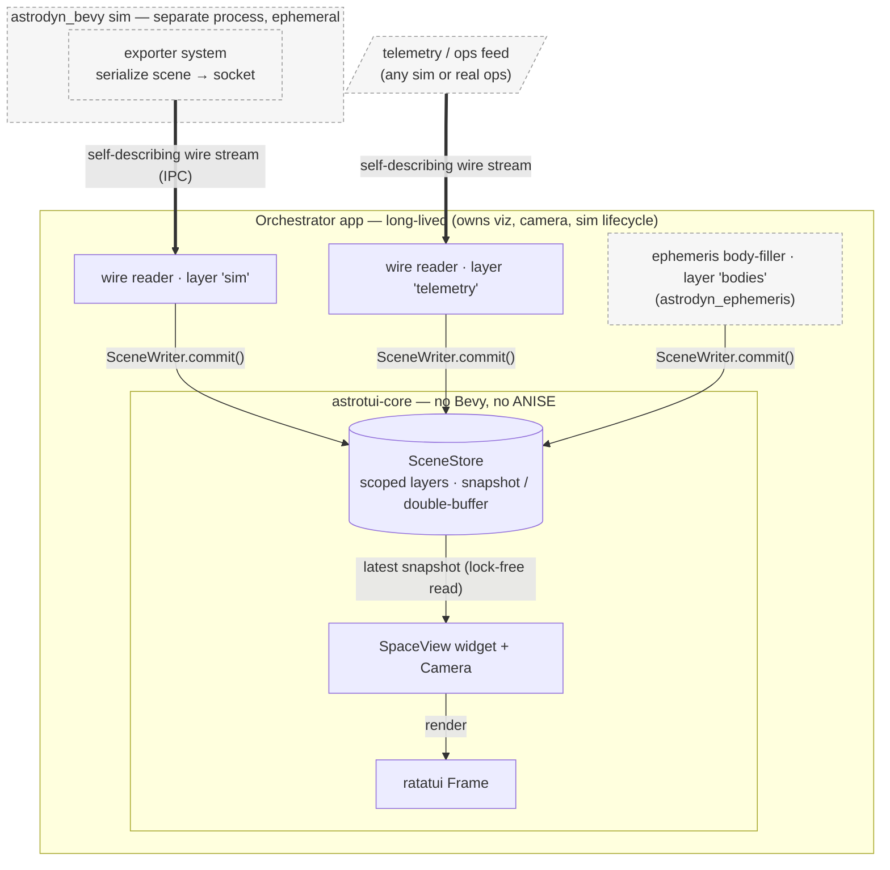
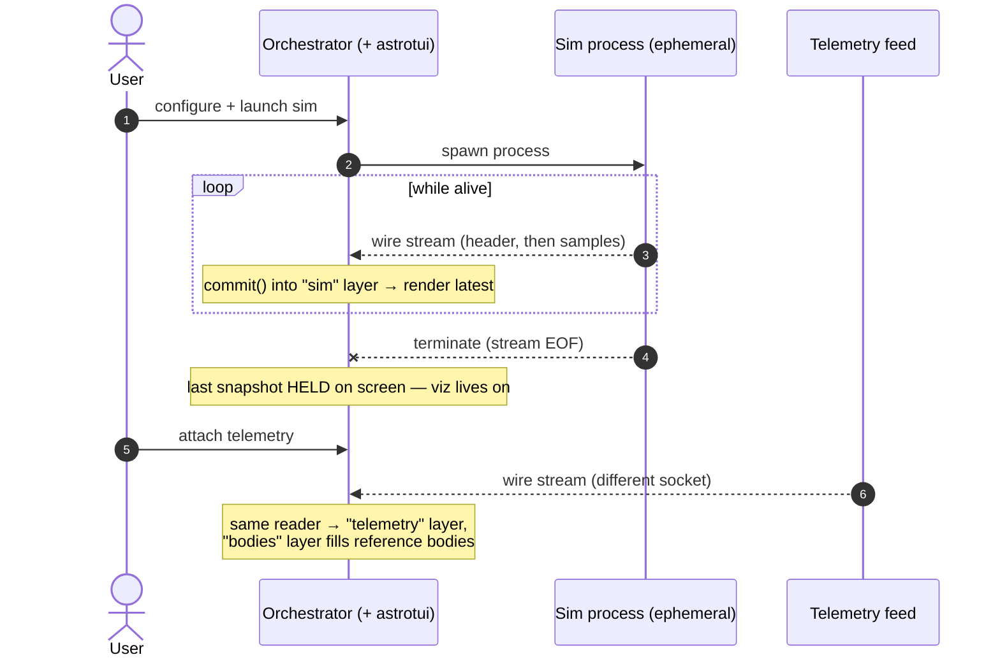
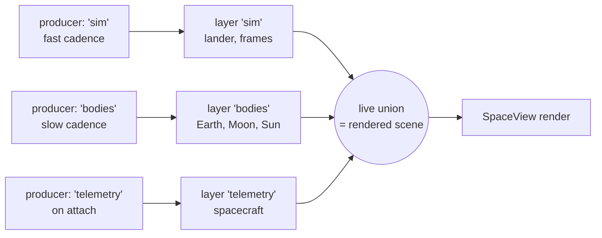
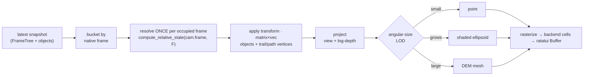
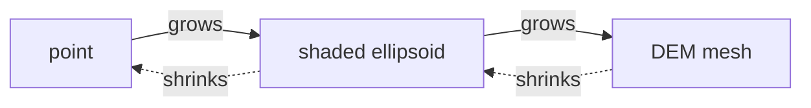
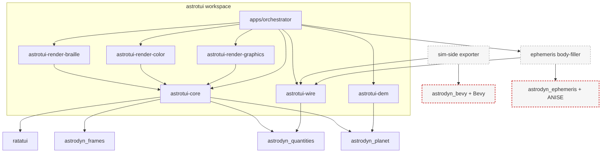

# astrotui — Design

> A [ratatui](https://github.com/ratatui/ratatui) widget for visualizing space
> scenarios in the terminal — anything from an Earth→Jupiter cruise down to a
> Moon landing over real DEM terrain. Inspired by
> [`d10n/tui-globe`](https://github.com/d10n/tui-globe), but for whole scenes,
> not a single globe.

**Status:** concept / pre-implementation. This document is the anchor; code
follows it.

---

## 1. Goals & non-goals

### Goals

- Render **any scene in the solar system** at any scale — interplanetary cruise,
  planetary system, orbit, surface approach, touchdown — with a single,
  seamless camera model.
- **Intuitive cameras** the user switches between (inertial chase, body-fixed,
  orbit-relative, local horizon, onboard), all defined in terms the user already
  thinks in: *reference frames*.
- Be a **drop-in plugin** for any host that wants space/mission viz in a TUI.
  The primary host is a long-lived **simulation orchestrator** that can watch a
  running sim, replay a log, or listen to a live telemetry/ops stream — but
  astrotui knows nothing about its host.
- For the Moon-landing case, render **realistic surface shape from DEMs**, since
  terrain drives where a lander can set down.

### Non-goals

- **No trajectory propagation.** astrotui is *viz only*: it renders the states it
  is handed. Something else (a sim, or real telemetry) owns and mutates the
  states.
- **No orbit determination, no force models, no time integration.**
- **No body placement.** astrotui does not compute where the Moon is; bodies
  arrive in the data stream like any other object. astrotui-core therefore links
  **neither Bevy nor ANISE/ephemeris** — it is a pure renderer.
- DEM *acquisition* and tiling pipeline detail is owned here, but the dynamics,
  frames, ephemeris, and body shapes are **not reimplemented** — they come from
  the [`astrodyn`](https://github.com/simnaut/astrodyn) workspace.

---

## 2. Substrate: the astrodyn workspace

astrotui is built on astrodyn (an ECS-based, NASA-JEOD-derived flight-dynamics
workspace in Rust). We consume its reference frames, typed quantities,
transforms, and body shapes rather than rolling our own — but **astrotui-core
depends only on the pure, Bevy-free, ANISE-free astrodyn crates**
(`astrodyn_frames`, `astrodyn_quantities`, `astrodyn_planet`). Bevy and ephemeris
appear only in *producers* that live outside astrotui (§4).

| Need | astrodyn surface | Used by |
|---|---|---|
| Frame tree + relative state | `astrodyn_frames`: `FrameTree`, `compute_relative_state(from, to) -> RefFrameState`; typed `orchestration::compute_relative_state_typed::<From, To>()` | **core** (render pass) |
| Typed frames | `astrodyn_quantities::frame`: `RootInertial`, `PlanetInertial<P>`, `PlanetFixed<P>`, `Ecef`, `BodyFrame<V>`, `Lvlh<C>`, `Ned<C>`, `Topocentric<P>`; planets `Earth/Moon/Sun/Mars`; `define_planet!`/`define_vehicle!` | **core** + producers |
| Typed quantities | `Position<F>` / `Velocity<F>` = `Qty3<D, F>` (`#[repr(C)]` over 3×f64), `raw_si() -> DVec3`, `from_raw_si()`, `zero()` | **core** + wire |
| Rotations | `NormalizedQuat<ScalarFirst, LeftTransform>` (JEOD convention), `FrameTransform<From, To>` (`.apply()`, `.matrix()`, `.inverse()`, `Mul` composition) | **core** |
| State + epoch wire format | `astrodyn_quantities::CartesianState<F>` = `{ position, velocity, epoch: SecondsSince<TDB> }`, serde behind the crate's non-default `serde` feature | **wire** |
| Body shape | `astrodyn_planet::PlanetShape { mu, r_eq, r_pol, flat_coeff }`; presets `EARTH/MOON/SUN/MARS/JUPITER/SATURN` | **core** (LOD/ellipsoid/DEM) |
| Body positions *(producer only)* | `astrodyn_ephemeris`: `Ephemeris::get_state_typed(target, observer, tdb) -> (Position<RootInertial>, Velocity<RootInertial>)` (DE421/DE440 via ANISE) | ephemeris body-filler (orchestrator-side) |
| Body-fixed orientation *(producer only)* | `Ephemeris::get_body_rotation_to::<P>(body, BodyFixedFrame, epoch) -> FrameTransform<RootInertial, PlanetFixed<P>>` (`Iau`, `MoonPaDe421`, `MoonMeDe421`) | sim exporter / body-filler |
| ECS state *(producer only)* | `astrodyn_bevy`: `TranslationalStateC<P>`, `RotationalStateC`, frame entities, `FrameOrigin`/`RelativeFrameState`, `SimulationTimeR` | sim-side exporter |

> All of the orientation/ME/IAU/serde/Topocentric surface above landed via
> astrodyn issue [#645](https://github.com/simnaut/astrodyn/issues/645), filed
> from this project. Before #645, the Moon-ME path required reaching around
> astrodyn into ANISE directly; it no longer does — and that path now lives in a
> *producer*, never in astrotui-core.

**What astrotui owns:** all rendering (projection, rasterization, terminal
backends), the scene data model + ingestion API, DEM ingest + tiling + LOD, the
self-describing wire codec, and body-shape presets beyond the six above (the rest
are one-line `PlanetShape::new`). astrodyn has no combined "scene" concept — that
is this project.

---

## 3. Core concept: a camera *is* a reference frame

Because the plugin only renders provided states, the entire per-object pipeline
collapses to **one astrodyn call** — *evaluate relative state against the camera's
frame*:

```rust
// Where is `obj` as seen from the camera's frame? FrameIds are RUNTIME values.
let s = compute_relative_state(&tree, cam.frame, obj.frame);  // dynamic, by FrameId
let pos_cam: DVec3 = s.trans.position.raw_si();   // metres, in camera coordinates
let vel_cam: DVec3 = s.trans.velocity.raw_si();   // m/s   -> leading indicators / HUD
let att_cam: DMat3 = s.rot.t_parent_this();        // object body axes, in camera frame
// -> log-depth project pos_cam -> braille / color cell / sixel
```

Everything an object needs to be drawn — position, orientation, velocity — comes
back in the **camera's own coordinates**. Therefore:

- **Switching cameras = evaluating relative state against a different frame.**
  No bespoke camera math per mode; the frame tree already encodes every
  relationship.
- The user's mental model ("look at this from the Moon-fixed frame", "ride the
  lander", "watch from the orbit-relative frame") maps 1:1 onto astrodyn's
  *existing* frame markers.

> **Dynamic, not typed, on the hot path.** Cameras switch and objects live on
> frame nodes chosen at *runtime* (`FrameId`), and the open set of frame types
> (`define_planet!`/`define_vehicle!`) cannot be enumerated in a `match`. So the
> render loop uses the dynamic `compute_relative_state(from_id, to_id)`. The
> typed `compute_relative_state_typed::<From, To>()` is used only at fixed call
> sites where both frames are known at compile time.

Camera presets — each is just a `FrameId` the camera sits in:

| Preset | astrodyn frame | Scenario |
|---|---|---|
| Solar-system overview | `RootInertial` | Earth→Jupiter cruise |
| Inertial chase | `PlanetInertial<P>` | orbits (non-rotating) |
| Body-fixed | `PlanetFixed<P>` | ground track, lunar approach (any body via `BodyFixedFrame::Iau`) |
| Orbit-relative | `Lvlh<V>` | nadir / ram-pointed from a spacecraft |
| Local horizon | `Topocentric<P>` | landing site / ground station, anchored at lat/lon |
| Vehicle local | `Ned<V>` | a *moving* vehicle's local NED |
| Onboard | `BodyFrame<V>` | cockpit / sensor boresight |

Seamless **log-zoom** layers cleanly on top: the *frame* sets origin and
orientation; a scalar **log-distance** dollies the eye along the view axis;
angular-size **LOD** picks point → shaded ellipsoid → DEM mesh as a body grows
on screen. The frame and the zoom are orthogonal.

---

## 4. System architecture

The decisive fact: **the viz outlives the things it watches.** A simulation runs
and terminates; a telemetry session connects and drops; the orchestrator (and the
astrotui widget inside it) persists across all of them. There is no shared
memory to borrow — data crosses a **lifecycle/process boundary by value.**



> Dashed/grey nodes are **external to astrotui** — the sim's exporter ships with
> the sim; the ephemeris body-filler is an orchestrator-side producer. Both speak
> only `astrotui-wire` / `SceneWriter`; neither is a dependency of the render core.

The viz outliving the sim is the load-bearing lifecycle property — shown over time:



- **Sims run as separate processes.** The orchestrator spawns one and reads the
  **self-describing wire stream** (§4.3) off a socket. A sim crash is a stream
  EOF, not a viz crash. The last snapshot stays on screen; the viz lives.
- **Telemetry is the same reader on a different socket** — a live sim and real
  ops data are indistinguishable to astrotui.
- **Bevy and ephemeris never enter astrotui.** The sim-side **exporter** (a small
  `astrodyn_bevy` system that serializes the wire format) ships *with the sim*.
  An **ephemeris body-filler** is an orchestrator-side producer that supplies
  reference bodies for feeds that don't carry them.

### 4.1 The plugin API — how data gets in

The host owns one `SceneStore` for the app's whole life. Producers receive
`SceneWriter` handles and publish into **named, isolated layers**:

```rust
// host owns the store for the app's lifetime:
let mut scene = SceneStore::new();
let camera    = Camera::overview();      // host-owned, user-driven

// each producer gets an isolated, named layer (Send + Clone handle):
let sim    = scene.writer("sim");        // fast spacecraft + frames from the sim stream
let bodies = scene.writer("ephemeris");  // slow, low-cadence reference bodies

// a producer publishes a transaction; commit() atomically replaces ITS layer:
let mut tx = sim.begin(epoch);
tx.frame (frame_id, parent_id, rel_state);   // frame node + state relative to parent
tx.object(obj_id, frame_id, state, meta);    // object state in its NATIVE frame
tx.commit();                                  // back-buffer swap; visible next render

// each TUI tick the host renders the latest committed snapshot — the union of layers:
frame.render_stateful_widget(SpaceView::new(&camera), area, &mut scene);
```

**Scoped layers** are the multi-producer model. Each writer owns a disjoint set
of frame/object ids; `commit()` replaces only that layer; the rendered scene is
the live **union** of layers. This gives every producer independent **lifecycle**
*and* **cadence** for free: the `"sim"` layer streams fast and freezes at EOF, the
`"ephemeris"` layer refreshes lazily (bodies barely move at real-time scale), and
a `"telemetry"` layer can take over when a sim ends — all without clobbering each
other.



### 4.2 The scene data model

astrotui-core **owns** the canonical render model (the `SceneStore`); producers
**populate it by value**. (Borrowing a producer's storage is impossible here —
the producer is across a process/lifecycle boundary — so the copy is inherent to
*observing* an external source, not avoidable waste.)

States are kept **in their natural frames**, *not* pre-projected into the camera
frame. The camera transform is applied per **render**, not per **ingest**, so
camera switching and log-zoom stay smooth at terminal frame rates even when a
producer is slow or bursty.

```rust
pub struct SceneObject {
    pub id:    ObjectId,
    pub label: Cow<'static, str>,        // shown in the camera/frame switcher UI
    pub frame: FrameId,                  // node in the FrameTree this object lives in
    pub kind:  ObjectKind,               // Body | Spacecraft | Site | Marker
    pub shape: Option<BodyShape>,        // astrodyn_planet::PlanetShape (+ optional DEM handle)
    pub trail: TrailRef,                 // plugin-PROVIDED ring buffer, PRODUCER-populated
    pub path:  Option<PathRef>,          // producer-supplied planned polyline
}
```

Frames and objects carry **stable ids + human labels + kind**, so the host's
camera UI can enumerate `scene.frames()` / `scene.objects()` and let the user
target any of them (the in-TUI frame/camera switcher, §10/P4).

**Concurrency.** A producer commits on its own thread into a back buffer; the
swap is atomic; the widget reads the latest snapshot lock-free. Trails are
append-only ring buffers; a snapshot pins the current write index so the render
sees a consistent prefix without copying the buffer.

### 4.3 The wire format — one self-describing stream

The serialized form is what crosses the socket from a spawned sim, arrives from
real ops, *and* sits in a replay file — **one codec** (`astrotui-wire`), so all
three are the same reader. It is **self-describing**: a header record carries the
frame topology + object metadata, then frame-tagged sample records stream:

```jsonc
// header (once, on connect / at start of file):
{ "type": "scene",
  "frames":  [ { "id": "moon_fixed", "parent": "moon_inertial",
                 "kind": "PlanetFixed<Moon>", "label": "Moon (ME)" }, … ],
  "objects": [ { "id": "lander", "frame": "moon_fixed",
                 "kind": "Spacecraft", "label": "LM", "shape": null }, … ] }

// samples (streamed thereafter):
{ "type": "sample", "epoch": 12345.6,
  "frames":  [ { "id": "moon_fixed", "rel_state": { "position": [x,y,z],
                                                    "velocity": [x,y,z],
                                                    "rot": [w,x,y,z] } } ],
  "objects": [ { "id": "lander", "position": [x,y,z], "velocity": [x,y,z] } ] }
```

Built on `astrodyn_quantities::CartesianState<F>` with the crate's `serde`
feature. Because each record carries its **frame id**, a log/stream is fully
**self-describing and replayable without the producer's code** — unlike a bare
`CartesianState` whose frame is an out-of-band compile-time choice. Only
`astrotui-wire` and producers enable `serde`; the render core stays serde-free.

> **Encoding is not locked — JSON above is illustrative.** The shape (header +
> frame-tagged samples) is the decision; the on-wire encoding is owned by
> `astrotui-wire`. **Future consideration (performance):** a high-rate descent
> feed over a socket will likely want a **binary framing** rather than JSON —
> `CartesianState<F>` is `#[repr(C)]` over f64s and so is trivially packable, and
> binary sidesteps per-sample float parse/format cost and text bloat. A
> reasonable path is JSON for the header (rare, human-debuggable) + a compact
> binary frame per sample, or a length-prefixed binary record for both. Defer the
> choice to `astrotui-wire`; keep the codec behind an interface so the encoding
> can change without touching producers or the render core.

### 4.4 The render pass

```rust
pub struct Camera {
    pub frame:  FrameId,       // the eye sits in / is oriented by this frame
    pub target: CameraTarget,  // a frame origin, a tracked object, or a fixed bearing
    pub zoom:   LogZoom,       // log-distance dolly along the view axis
    pub up:     UpHint,
    pub fov:    f64,
}
```

Per frame, over the latest snapshot's `FrameTree`:

1. **Bucket** objects (and their trails/paths) by native frame.
2. **Resolve once:** for each *occupied* frame `F`, compute a single
   `compute_relative_state(camera.frame, F)` and cache the transform.
3. **Apply** the cached transform by matrix-vector to every object/trail/path
   vertex in `F` → `pos_cam`/`vel_cam`/`att_cam`. (A planned path of thousands of
   points costs one tree-walk, not thousands.)
4. **Project** `pos_cam` through view + log-depth.
5. **LOD** on angular size → point | shaded ellipsoid | DEM mesh.
6. **Rasterize** into the active backend's cell buffer → ratatui `Buffer`.



Working in camera-relative coordinates is also what keeps the projection
numerically safe across ~12 orders of magnitude: the render never differences two
huge absolute positions — magnitudes near the camera are small by construction.

---

## 5. Rendering

### 5.1 Pluggable backends

A `Renderer` trait with three backends, auto-detected from terminal
capabilities (highest available wins, braille is the floor):

| Backend | Technique | DEM fidelity |
|---|---|---|
| Braille | monochrome braille dots (tui-globe style) | wireframe / contour silhouette |
| Color cells | 24-bit color half-blocks, dithered shading | shaded heightfield (hypsometric/hillshade) |
| Graphics protocol | sixel / kitty / iTerm raster | near-photoreal hillshade |

### 5.2 Scale: one seamless log-zoom camera

A single logarithmic-depth camera spans the ~12 orders of magnitude between
interplanetary cruise and a lunar touchdown. Angular-size LOD on
`pos_cam.length()` vs `shape.r_eq()` selects the representation, with hysteresis
on the thresholds so bodies near a boundary don't oscillate:



The dashed back-edges denote the hysteresis: the grow and shrink thresholds
differ, so a body hovering at a boundary doesn't flip representations every
frame.

---

## 6. Moon-landing path (DEM)

This is the first target scenario. Post-#645 the *frame* integration is the
lowest-risk part; the **DEM pipeline is the real new engineering** (§9, §11).

1. **Body-fixed frame, supplied by the producer.** Lunar cartography (LOLA,
   SLDEM2015) is referenced to the **Mean-Earth/mean-rotation (ME)** frame,
   NAIF 31007 — *not* the principal-axis frame the gravity field uses. The sim
   exporter (or, for an ops feed, the ephemeris body-filler) computes the ME
   transform and ships it as a frame in the stream:

   ```rust
   // PRODUCER side (sim exporter or body-filler) — not astrotui-core:
   let me: FrameTransform<RootInertial, PlanetFixed<Moon>> =
       eph.get_body_rotation_to::<Moon>(EphemerisBody::Moon, BodyFixedFrame::MoonMeDe421, epoch)?;
   tx.frame(moon_fixed_id, root_id, me_as_rel_state);
   ```

   astrodyn bundles the PA→ME frame kernel (`moon_fk_de421.epa`) and applies the
   offset internally; no parallel ANISE Almanac, no hardcoded constant. astrotui
   just receives the resulting frame.

2. **DEM → geometry (astrotui-dem).** DEM tiles (lat/lon/height over the lunar
   mean radius) → Cartesian in `PlanetFixed<Moon>` using
   `astrodyn_planet::MOON` (r_eq 1738.14 km, r_pol 1736.07 km) + height. Those
   vertices live on the Moon-fixed node, so `compute_relative_state` to the camera
   renders them with no special-casing.

3. **Camera.** `Topocentric<Moon>` anchored at the target site (a child node under
   the Moon-fixed frame, declared by the producer) for the local-horizon descent
   view; `PlanetFixed<Moon>` for the overhead approach.

4. **Lighting.** The Sun is an ordinary object in the stream; its position
   relative to the Moon-fixed frame (via `compute_relative_state`) gives the
   hillshade direction. No ephemeris in astrotui.

5. **Overlays.** Producer-populated descent **trail** + producer-supplied planned
   **path**; flight-path marker from `vel_cam`.

---

## 7. Trajectories

The plugin never propagates. Two complementary overlays, both producer-driven:

- **Rolling trail** — astrotui *provides* the ring-buffer container; the
  **producer populates it** at full rate (the store appends on each committed
  upsert, so no telemetry sample is dropped between renders). Telemetry-friendly.
- **Planned path** — the producer supplies a complete polyline for the
  planned/future track. Sim-friendly.

Both are stored in their natural frame and projected through the active camera
like any other geometry.

---

## 8. Reference / harness app (`orchestrator`)

One binary proves the *same widget* against the *same wire reader* on three
sources, with the viz outliving each:

- **(a) Live sim** — spawn an astrodyn Bevy lunar-descent sim as a child process;
  read its exported wire stream.
- **(b) Replay** — read a recorded descent file (same wire format) and play it
  back.
- **(c) Telemetry** — connect to a socket carrying a spacecraft-only feed; the
  ephemeris body-filler layer supplies Earth/Moon/Sun.

The sim terminates; the orchestrator stays up, last frame held, ready to attach
the next source. Moon-landing-first anchors development; a later Earth→Jupiter
cruise scene proves the broad "any solar-system scene" claim (Jupiter/Saturn from
presets, any body via `BodyFixedFrame::Iau`).

---

## 9. Crate layout

```
astrotui/
├── crates/
│   ├── astrotui-core            # widget + Renderer trait + Camera + SceneStore/SceneWriter
│   │                            #   deps: ratatui, astrodyn_frames, astrodyn_quantities, astrodyn_planet
│   │                            #   NO bevy, NO ephemeris/ANISE
│   ├── astrotui-render-braille  # braille backend
│   ├── astrotui-render-color    # 24-bit color-cell backend
│   ├── astrotui-render-graphics # sixel/kitty backend
│   ├── astrotui-wire            # self-describing stream codec (socket / replay); enables `serde`
│   └── astrotui-dem             # DEM ingest / tiling / LOD
└── apps/
    └── orchestrator             # reference host: spawn-sim + replay + telemetry listen

  external to astrotui (not in this workspace):
    • sim-side exporter   — astrodyn_bevy system that serializes the wire format (ships with the sim)
    • ephemeris body-filler — orchestrator-side producer using astrodyn_ephemeris
```

`astrotui-core` depends only on the pure, Bevy-free, ephemeris-free astrodyn
crates. Bevy enters only in the sim's exporter; ANISE/ephemeris only in the
body-filler producer. Both speak `astrotui-wire` / `SceneWriter` — neither is a
dependency of the render core.



> The red-outlined nodes (`Bevy`, `ANISE`) are the heavy / churn-prone deps —
> note they connect **only** to the dashed external producers, never to
> `astrotui-core` or any render crate. That firewall is the whole point.

---

## 10. Phasing

| Phase | Deliverable |
|---|---|
| **P0** | `SceneStore` + scoped `SceneWriter` + snapshot/double-buffer; braille backend; `RootInertial` overview; a trivial in-process producer feeding Earth/Moon/Sun points. *Validates camera=frame + projection + ingestion.* |
| **P1** | Camera presets + seamless log-zoom + LOD (point → shaded ellipsoid); color-cell backend; `astrotui-wire` codec + replay reader. |
| **P2** | Moon-landing slice: producer-supplied `MoonMeDe421` frame, `Topocentric<Moon>` camera, trail + path. **DEM via a dedicated design doc + staged build:** (1) one static pre-tiled site → mesh → shade end-to-end, (2) dynamic tiling/paging, (3) LOD + memory budget, (4) hillshade across all backends. |
| **P3** | Separate-process sim + exporter; orchestrator spawn/observe lifecycle; telemetry listen + ephemeris body-filler layer; backend auto-detect. |
| **P4** | Earth→Jupiter cruise scene, HUD, in-TUI frame/camera switcher driven by `scene.frames()`. |

---

## 11. Open items

- **DEM design doc** (LOLA vs SLDEM2015, tile scheme, on-disk vs fetched, LOD,
  memory budget) — owned by `astrotui-dem`, gates P2 code.
- **Backpressure/coalescing policy** — when a producer outruns the TUI frame
  rate, ingestion processes every sample (so trails stay complete) while render
  reads the latest; the firehose fallback (coalesce, accept trail gaps) is a
  tunable to specify in P3.
- **Backend capability detection** heuristics (sixel/kitty probing, graceful
  fallback) — to be specified in P3.
- **Four planet presets** (Mercury/Venus/Uranus/Neptune) self-supplied via
  `PlanetShape::new` until astrodyn adds them (#645 added Jupiter/Saturn only;
  bodies are oblate-only, no triaxial).

---

## 12. Key decisions (summary)

1. **Camera = reference frame**; switching cameras = `compute_relative_state`
   against a different `FrameId`. Dynamic by `FrameId` on the hot path (typed API
   only at fixed sites); transform resolved once per occupied frame, applied by
   matrix to all geometry.
2. **astrotui is a host-agnostic plugin**; the primary host is a long-lived
   orchestrator whose **viz lifecycle is independent of the sim's**.
3. **Sims run as separate processes** streaming a wire format; **telemetry is the
   same reader on a different socket**. Sim EOF ≠ viz death; last snapshot holds.
4. **astrotui-core links no Bevy and no ANISE/ephemeris** — a pure renderer.
   Bevy lives only in the sim-side exporter; ephemeris only in an
   orchestrator-side body-filler. **Bodies arrive in the stream** like any object.
5. **Core owns the `SceneStore`; producers populate it by value** (the
   lifecycle/process boundary makes the copy inherent, not waste).
6. **Ingestion is scoped layers**: named `SceneWriter`s own disjoint id sets;
   `commit()` replaces only that layer; render = live union; independent lifecycle
   *and* cadence per producer.
7. **Interchange is one self-describing stream** (`astrotui-wire`): header
   (topology + metadata) + frame-tagged samples; serves socket, telemetry, and
   replay identically; replayable without the producer's code.
8. **Snapshot / double-buffer** decouples producer rate from TUI frame rate;
   states kept in natural frames, camera applied per-render.
9. **Trails are a plugin-provided container, producer-populated** at full rate;
   planned paths are producer-supplied. Never propagated here.
10. **Pluggable backends** (braille / color / graphics), auto-detected.
11. **One seamless log-zoom camera** with angular-size LOD (hysteresis on
    transitions).
12. **DEM is the real P2 lift** — full pipeline, but gated by a dedicated design
    doc and built in verifiable stages.
